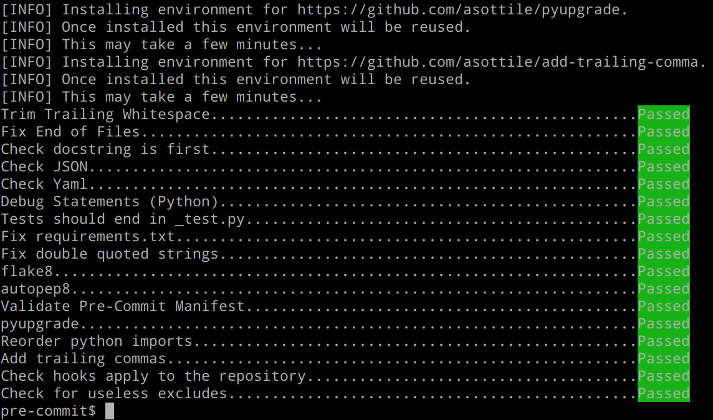

# Unofficial Snap Packaging for pre-commit
<!--
	Use the Staticaly service for easy access to in-repo pictures:
	https://www.staticaly.com/
-->

**This is the unofficial snap for pre-commit**, *"A framework for managing and maintaining multi-language pre-commit hooks"*. It works on Ubuntu, Fedora, Debian, and other major Linux distributions.

Published for  with 💝 by Snapcrafters

<!-- Uncomment and modify this when you have published the snap to the Snap Store
## Installation
([Don't have snapd installed?](https://snapcraft.io/docs/core/install))

### In a Terminal
    # Install the snap #
    sudo snap install --channel=edge --devmode pre-commit
    #sudo snap install --channel=beta pre-commit
    #sudo snap install pre-commit
    
    # Connect the snap to essential security confinement interfaces #
    ## (Proper reasoning for connecting _plug_name_) ##
    sudo snap connect pre-commit:_plug_name_
    
    # Connect the snap to optional security confinement interfaces #
    ## (Proper reasoning for connecting _plug_name_) ##
    sudo snap connect pre-commit:_plug_name_
    
    # Launch the application #
    pre-commit
    snap run pre-commit # If you have another existing installation

### The Graphical Way

-->

## What is Working
* Launch
* `pre-commit run --all-files` on `pre-commit/pre-commit`
* `pre-commit run --all-files` on a repository that has arbitrary depending command hook
* `pre-commit.validate-config`

## What is NOT Working...yet 
Check out the [issue tracker](https://github.com/Lin-Buo-Ren/pre-commit-snap/issues) for known issues.

## Support
* Report issues regarding using this snap to the issue tracker:  
  <https://github.com/Lin-Buo-Ren/pre-commit-snap/issues>
* You may also post on the Snapcraft Forum, under the `snap` topic category:  
  <https://forum.snapcraft.io/c/snap>
